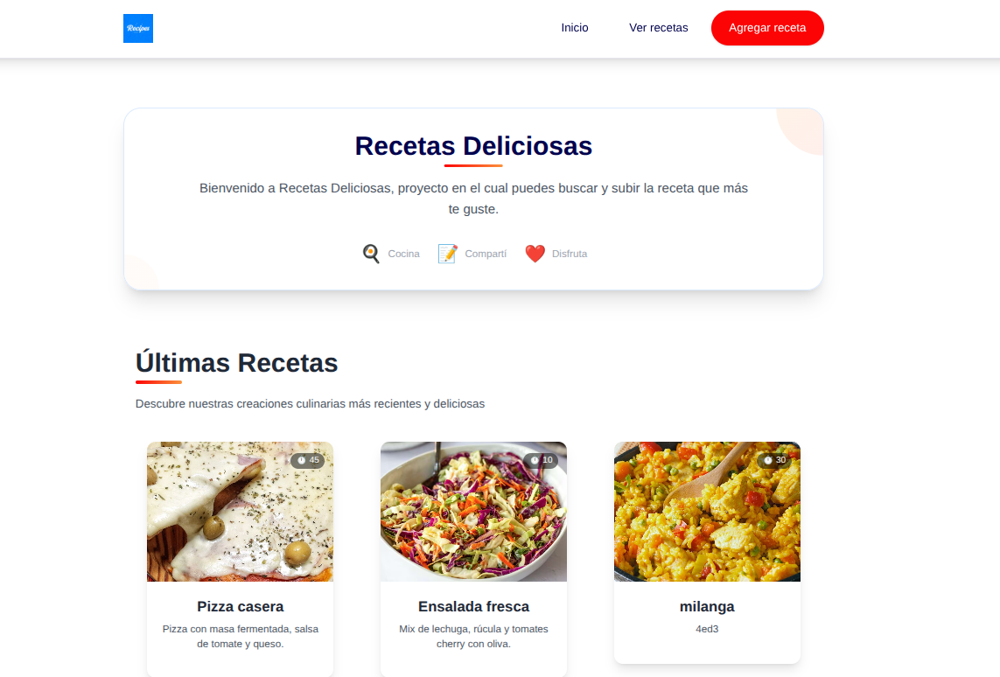
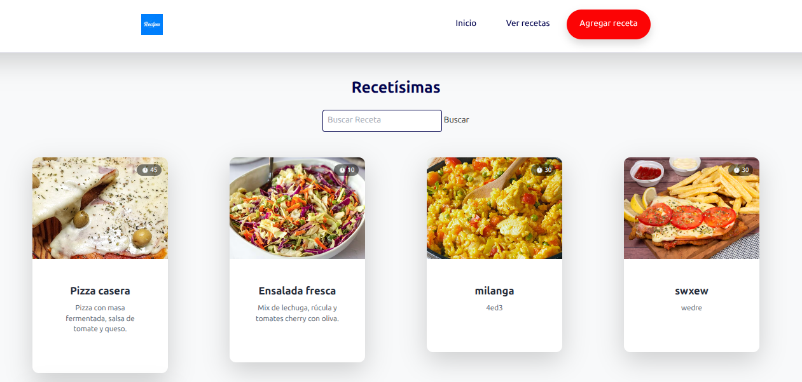
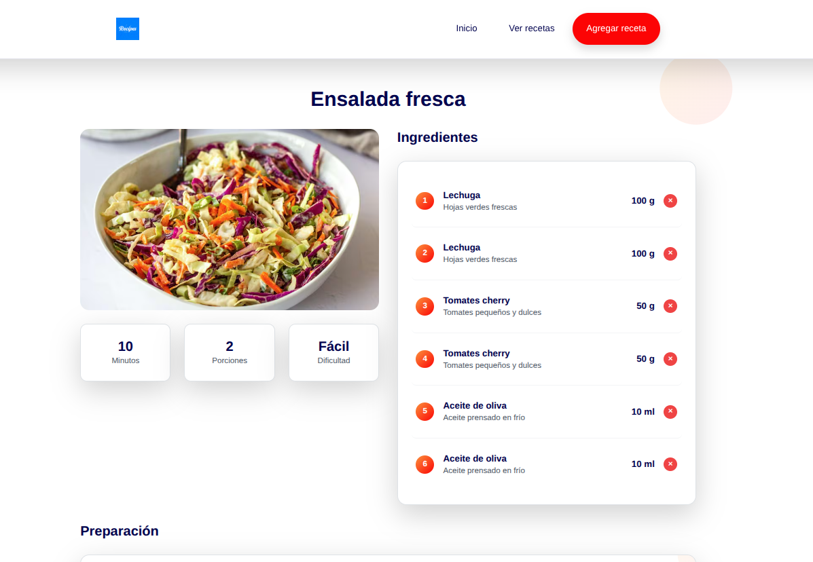
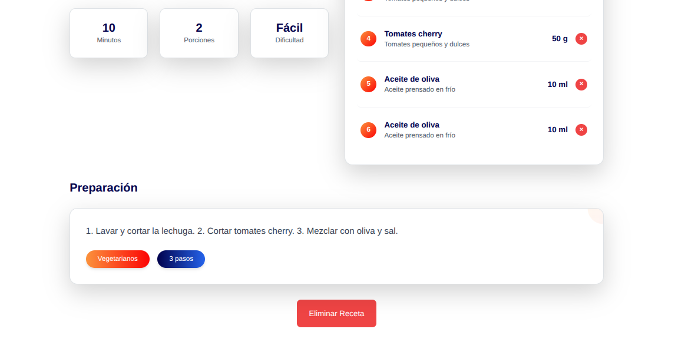
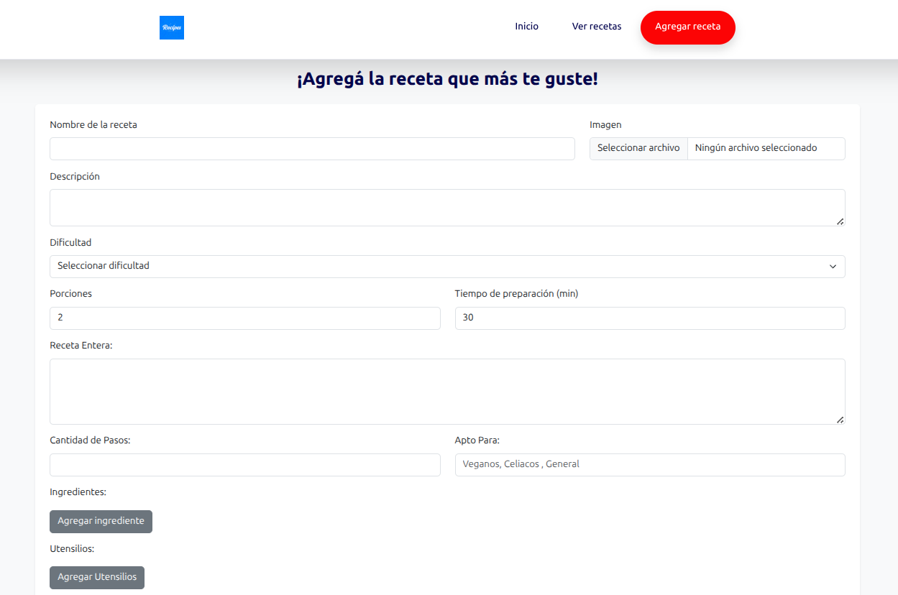

# 🍽️ Recetisimas - Proyecto Final

El siguiente proyecto conforma la fase final de la materia introducción al desarrollo de software de la cátedra Camejo, FIUBA. El mismo permite al usuario informarse acerca de diferentes recetas de comida, gestionarlas y agregar la que más le guste.
---

## 📸 Capturas de pantalla


### Vista principal


### Recetario (aca se puede buscar la receta que más le guste)


## Información y gestión de la receta (en esta sección se podra informar y gestionar parte de la receta)



## Formulario para agregar una receta 


---


---

## 🚀 Cómo levantar el sistema

### Requisitos previos

- Tener instalado:
  - [Docker](https://www.docker.com/)
  - [Docker Compose](https://docs.docker.com/compose/)

---

### 🔧 Configuración rápida

1. Clonación del repositorio:

```bash
git clone https://github.com/ljz510/sitio-web.git
cd sitio-web
```
### Levantar la BDD 
```bash
docker-compose up -d
```
